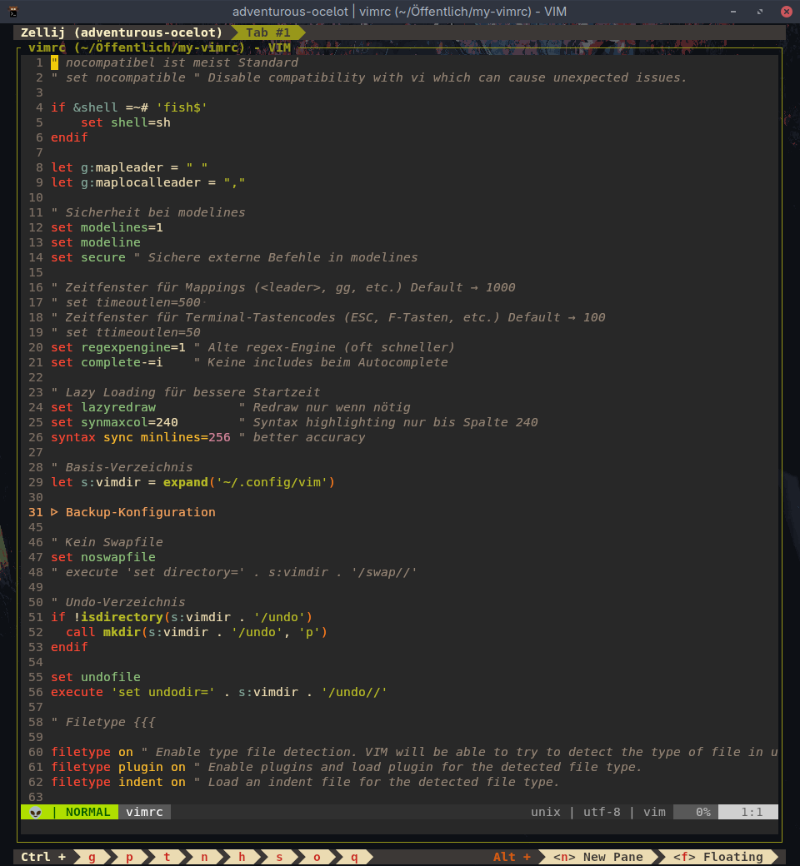
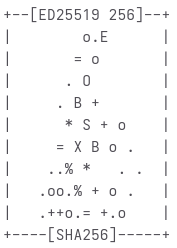

# my-vimrc

### Favourite Terminal-Tools 

| Name | Description |
|-----|-------------|
| [age](https://github.com/FiloSottile/age) | Encryption tool |
| [bat](https://github.com/sharkdp/bat) | Modern replacement for cat |
| [ble.sh](https://github.com/akinomyoga/ble.sh) | Bash Line Editor |
| [bottom (btm)](https://github.com/ClementTsang/bottom) | Process/system monitor |
| [broot](https://github.com/Canop/broot) | Navigate directory trees |
| [btop](https://github.com/aristocratos/btop) | Monitor of resources |
| [daylight](https://github.com/jhawthorn/daylight) | Track sunrise and sunset times |
| [duf](https://github.com/muesli/duf) | Disk Usage/Free Utility |
| [dust](https://github.com/bootandy/dust) | Disk space monitor |
| [ekphos](https://github.com/hanebox/ekphos) | Markdown research tool |
| [fastfetch](https://github.com/fastfetch-cli/fastfetch) | System information |
| [fdfind (fd)](https://github.com/sharkdp/fd) | Find files |
| [feh](https://github.com/derf/feh) | Image viewer |
| [frogmouth](https://github.com/Textualize/frogmouth) | Markdown browser |
| [fzf](https://github.com/junegunn/fzf) | Fuzzy finder |
| [getnf](https://github.com/getnf/getnf) | Install Nerd Fonts |
| [git-delta](https://github.com/dandavison/delta) | A viewer for git and diff output |
| [git-igitt](https://github.com/mlange-42/git-igitt) | Browse and visualize Git history graphs |
| [git](https://git-scm.com/) | Versionskontrollsystem |
| [glances](https://github.com/nicolargo/glances) | System monitor |
| [gogh](https://github.com/Gogh-Co/Gogh) | Color scheme for your terminal |
| [grc](https://github.com/garabik/grc) | Generic Colourizer |
| [gtop](https://github.com/aksakalli/gtop) | System monitor |
| [hstr](https://github.com/dvorka/hstr) | History search |
| [jrnl](https://github.com/jrnl-org/jrnl) | Note collector |
| [lazygit](https://github.com/jesseduffield/lazygit) | UI für Git |
| [lsd](https://github.com/lsd-rs/lsd) | Display directories with colors and icons |
| [lstr](https://github.com/jarun/lstr) | Tree viewer |
| [mcfly](https://github.com/cantino/mcfly) | History search |
| [ncdu](https://dev.yorhel.nl/ncdu) | Disk usage analyzer |
| [pass](https://www.passwordstore.org/) | Passwort-Manager |
| [ranger](https://github.com/ranger/ranger) | Datei-Manager (Vim-like) |
| [ripgrep (rg)](https://github.com/BurntSushi/ripgrep) | Directory search tool |
| [rnr ](https://github.com/ismaelgv/rnr) | Batch rename files and directories |
| [rovr](https://github.com/rovr/rovr) | File manager |
| [speedtest-cli](https://github.com/sivel/speedtest-cli) | Speedtest von Ookla |
| [taskwarrior](https://github.com/GothenburgBitFactory/taskwarrior) | Todo-Liste |
| [trash-cli](https://github.com/andreafrancia/trash-cli) | Trashcan |
| [vifm](https://github.com/vifm/vifm) | Datei-Manager |
| [vim-nox](https://www.vim.org/) | Schlanker Vim für den Terminal |
| [vimv](https://github.com/thameera/vimv) | Mass rename files using Vim |
| [zoxide](https://github.com/ajeetdsouza/zoxide) | Smarter cd command |
| [zxcvbn](https://github.com/dropbox/zxcvbn) | Passwort-Check |

 &nbsp;&nbsp;&nbsp; &nbsp;&nbsp;&nbsp; 

